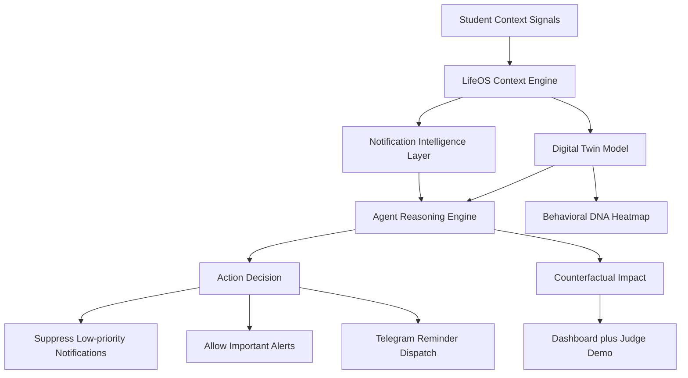

# LifeOS Campus

LifeOS Campus is a behavioral AI operating layer for students that reduces cognitive overload using context-aware agents, a Digital Twin, and intelligent notification intervention.

## 1. Problem

Students face constant cognitive disruption:
- Notification overload from social and utility apps
- Fragmented schedules across classes, commute, and deadlines
- Stress spikes near exams and assignment clusters
- Context switching that breaks deep-work continuity
- Delayed or missed high-priority reminders

## 2. Solution

LifeOS Campus models student context and attention state, then acts proactively:
- Observes context signals (mode, schedule windows, behavior patterns)
- Predicts likely stress/focus conditions through a Digital Twin layer
- Explains why the agent acted (not just what happened)
- Suppresses low-priority interruptions
- Surfaces high-priority alerts at the right time
- Shows counterfactual impact (with vs without intervention)

## 3. Key Features

- AI Day Management Hero
- Digital Twin
- Agent Reasoning
- Counterfactual Impact
- Agent Activity Stream
- Behavioral DNA Heatmap
- Telegram Alert Layer
- Judge Demo Mode
- `/demo` and `/live` modes

## 4. Architecture



## 5. Privacy-first On-device Digital Twin

LifeOS is designed to model behavior locally first.  
For a production-grade version:
- Sensitive raw behavior traces should stay on-device by default
- Cloud channels should receive only minimal alert payloads
- Full personal history should not be transmitted for routine reminders
- Privacy-preserving sync or federated learning can be used for future cross-device intelligence

This hackathon prototype demonstrates decision logic using local/simulated dashboard data and selective Telegram notifications.

## 6. Real vs Simulated (Hackathon Disclosure)

- **Real in this prototype**
  - Local Flask dashboard routing and rendering
  - Notification scoring/queueing flow
  - Mode/context memory pipeline
  - Telegram dispatch integration path
- **Simulated in this prototype**
  - Some dashboard overlays and demo narrative signals
  - Some judge-demo event stream entries
  - Twin confidence/impact storytelling metrics for presentation clarity

## 7. Judge Demo Reliability

Judge Demo is resilient by design:
- Launch button is bound in UI (`judge-start`)
- Tour targets include hero, decision banner, reasoning, counterfactual, twin, notifications, status
- Missing targets are safely skipped
- Console warnings are emitted for missing targets
- Tour continues to next valid step without crashing

## 8. How to Run

```powershell
cd "C:\Users\jyoti\OneDrive\Desktop\lifeos-campus"
python -m pip install -r requirements.txt
python dashboard.py
```

Open:
- [Dashboard](http://localhost:5000/)
- [Demo Mode](http://localhost:5000/demo)
- [Live Mode](http://localhost:5000/live)

## 9. Stability Verification

Lightweight route smoke check script:

```powershell
python scripts/dashboard_route_check.py
```

Expected result:
- `/` returns 200
- `/demo` returns 200
- `/live` returns 200
- `/api/status` returns 200
- `/api/twin` returns 200

## 10. 60-second Demo Script (Judge Flow)

1. **0s-8s**: Open hero and say: "LifeOS is already managing the student's day autonomously."
2. **8s-18s**: Highlight Digital Twin and mention stress/focus prediction.
3. **18s-30s**: Show Agent Reasoning card: Trigger -> Inference -> Action -> Outcome.
4. **30s-40s**: Show Counterfactual Impact: with vs without LifeOS.
5. **40s-50s**: Show Activity Stream + notification routing outcomes.
6. **50s-60s**: Launch Judge Demo and close with "LifeOS prevented distraction before it happened."

## 11. Screenshots and GIF Placeholders

Add assets here before final submission:
- `assets/screenshots/main-dashboard.png`
- `assets/screenshots/digital-twin.png`
- `assets/screenshots/agent-reasoning.png`
- `assets/screenshots/counterfactual-impact.png`
- `assets/screenshots/behavioral-dna.png`
- `assets/screenshots/judge-demo.png`
- `assets/screenshots/judge-demo.gif`

Live demo video (watch online):  
[LifeOS Campus Demo Video](https://drive.google.com/file/d/1ojnuuT9ge-s7fGzfitC20jdP-wpMTH8B/view?usp=sharing)

## Submission Files

- AI Disclosure Form: `assets/submission/OpenClaw_AI_Disclosure.docx`
- Presentation Deck: `assets/submission/LifeOS_Campus.pptx`

## Generate Demo Assets

```bash
python scripts/capture_dashboard_assets.py
```

Notes:
- Start dashboard first in another terminal: `python dashboard.py`
- Script saves PNG and GIF assets into `assets/screenshots/`
- GIF captures a short judge-flow walkthrough (~15–30s)

## 12. API Endpoints

- `GET /` -> Main dashboard
- `GET /demo` -> Enables demo overlay mode, redirects to `/`
- `GET /live` -> Disables demo overlay mode, redirects to `/`
- `GET /api/status` -> Aggregated dashboard state
- `GET /api/twin` -> Digital Twin card payload

## 13. Hackathon Note

LifeOS Campus focuses on explainable intervention, not just visualization.  
The dashboard is intended to show decision quality, behavioral impact, and user trust in an AI operating layer for student life.
