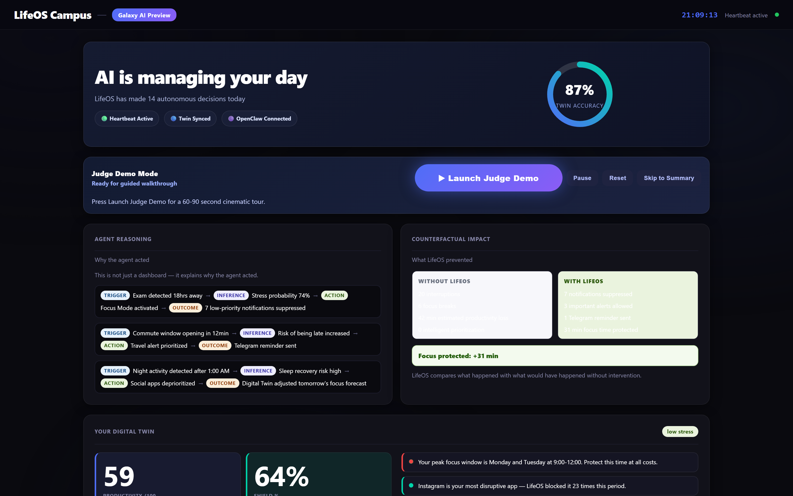
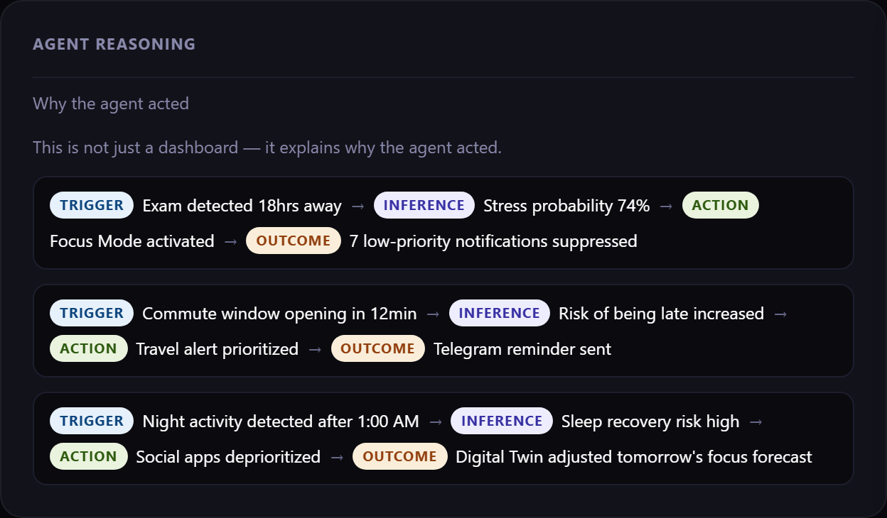
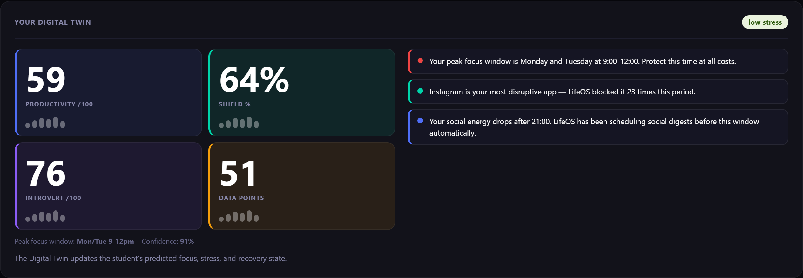
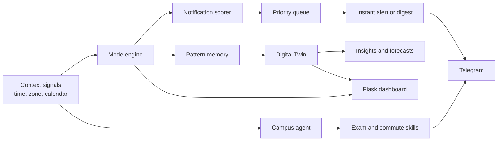

# LifeOS Campus

[](https://github.com/prajwalsamsonck/lifeos-campus/actions/workflows/ci.yml)
[](https://www.python.org/)
[](https://flask.palletsprojects.com/)

LifeOS Campus is a local-first student attention assistant that combines
context-aware modes, notification triage, calendar and commute signals, and a
behavioral Digital Twin. It was built by **Team Pragmatists** for Samsung PRISM
Clash of the Claws 2026, where the team received a **Special Mention**.



## What It Does

- Selects sleep, commute, class, focus, or hostel modes from time and location context.
- Scores incoming notifications and either delivers or holds them for a digest.
- Detects exam-heavy weeks and upcoming departure windows.
- Learns recurring behavior through local pattern memory.
- Produces Digital Twin productivity, stress, and attention-shield insights.
- Sends optional alerts and reports through Telegram.
- Explains decisions through an interactive Flask dashboard and guided judge demo.

## Demo

- [Watch the demo video](https://drive.google.com/file/d/1ojnuuT9ge-s7fGzfitC20jdP-wpMTH8B/view?usp=sharing)
- [View the presentation deck](assets/submission/LifeOS_Campus.pptx)
- [Open the judge-demo recording](assets/screenshots/judge-demo.gif)

| Agent reasoning | Digital Twin |
| --- | --- |
|  |  |

## Architecture



The prototype is deliberately local-first. Behavioral events are stored in
JSON files beside the application, while external services receive only the
alert payloads needed for the demo.

## Quick Start

Requirements:

- Python 3.10 or newer
- Git LFS, if you want to retrieve the large local video asset

```bash
git clone https://github.com/prajwalsamsonck/lifeos-campus.git
cd lifeos-campus
python -m venv .venv
```

Activate the environment:

```powershell
# Windows
.\.venv\Scripts\Activate.ps1
```

```bash
# macOS or Linux
source .venv/bin/activate
```

Install and launch:

```bash
python -m pip install -r requirements.txt
python dashboard.py
```

Open:

- Dashboard: <http://127.0.0.1:5000/>
- Demo data overlay: <http://127.0.0.1:5000/demo>
- Live local data: <http://127.0.0.1:5000/live>

The dashboard works without API credentials by using the included demo data.

## Optional Integrations

Copy `.env.example` to `.env` and add only the services you want to use:

```env
TELEGRAM_TOKEN=your_bot_token_here
TELEGRAM_CHAT_ID=your_chat_id_here
DEMO_MODE=true
DEMO_DIGEST_DELAY=0
GOOGLE_CALENDAR_KEY=your_google_calendar_api_key_here
GOOGLE_MAPS_KEY=your_google_maps_api_key_here
```

Telegram credentials enable external alerts. Google credentials are optional;
the calendar and commute modules fall back to deterministic mock data when they
are absent or unavailable.

## Commands

```bash
# Run the continuous context loop
python agent.py

# Run the complete narrated demo
python demo_runner.py

# Verify dashboard routes
python scripts/dashboard_route_check.py

# Run automated tests
python -m pytest
```

To regenerate screenshots and the GIF:

```bash
python -m pip install -r requirements-dev.txt
python -m playwright install chromium
python dashboard.py
# In another terminal:
python scripts/capture_dashboard_assets.py
```

## Project Structure

```text
.
|-- agent.py                    # Continuous agent entry point
|-- campus_agent.py             # Calendar, commute, exam, and pattern orchestration
|-- dashboard.py                # Flask API and embedded dashboard UI
|-- digital_twin.py             # Behavioral profile and insight generation
|-- notification_scorer.py      # Notification priority model
|-- notification_queue.py       # Hold/pass-through queue
|-- pattern_memory.py           # Local behavior learning
|-- telegram_bot.py             # Optional Telegram delivery
|-- openclaw_bridge.py          # Command bridge used by the hackathon integration
|-- assets/                     # Screenshots, deck, disclosure, and video pointer
|-- scripts/                    # Route verification and asset capture
`-- tests/                      # Core behavior and route tests
```

## Prototype Scope

The notification flow, mode engine, local memory, Flask routes, Digital Twin
calculations, and Telegram delivery path are implemented. Some dashboard
metrics, judge-demo events, and counterfactual values are presentation data,
not results from a production device study. The `87%` figure shown in the demo
is a narrative prototype metric rather than a validated scientific benchmark.

## Team, Attribution, and Disclosure

LifeOS Campus was created as a team hackathon project by **Team Pragmatists**.
This repository preserves the original history from
[`jyotiradityadeb/lifeos-campus`](https://github.com/jyotiradityadeb/lifeos-campus)
and is maintained here by
[`prajwalsamsonck`](https://github.com/prajwalsamsonck).

The original submission included required disclosure of assisted development
tools. That record is retained in
[`assets/submission/OpenClaw_AI_Disclosure.docx`](assets/submission/OpenClaw_AI_Disclosure.docx).
See [`NOTICE.md`](NOTICE.md) for provenance and licensing status.
